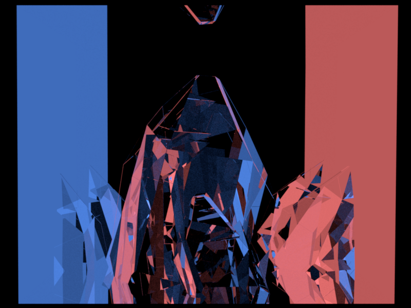

# Path Tracing

**Authors:**

- Eryka Liced Rimacuna Castillo     816778
- Javier Franco Ramírez             799577

**Section 2**

As we can see in `figures/interesting_1` we use an external object.

The provided scene features a highly reflective environment with walls that emit light in contrasting colors (red and blue). The central crystalline object, made of dielectric material, refracts and reflects light intricately, splitting colors and interacting beautifully with the soft blue and red light sources. The bright yellow point lights contribute to highlights and enhance the crystalline appearance.

**References**
All the figures: 
- https://drive.google.com/drive/folders/1pclce982xlk-DHfdIHGocK6viTJ0yJnq?usp=sharing

- https://github.com/816778/Modeling_Practicas.git

